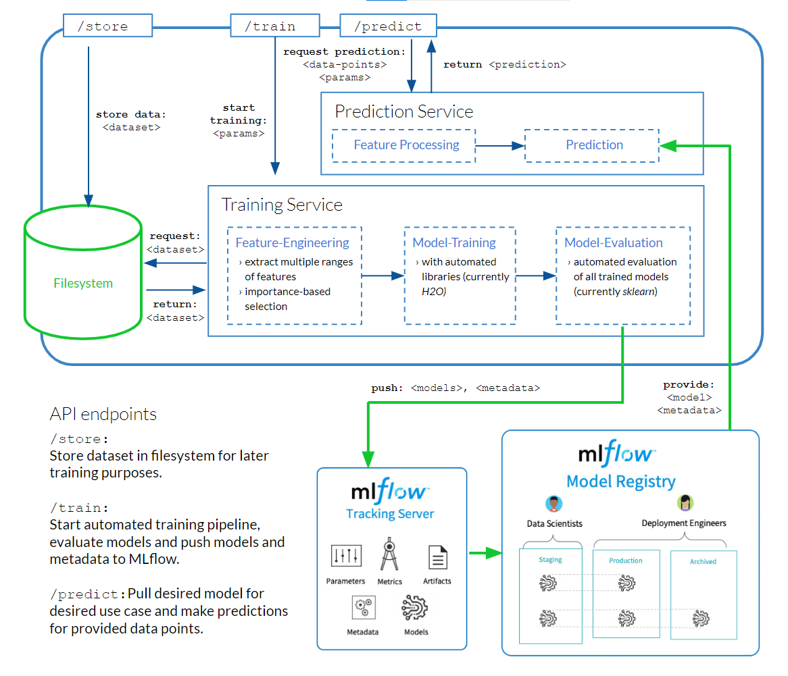
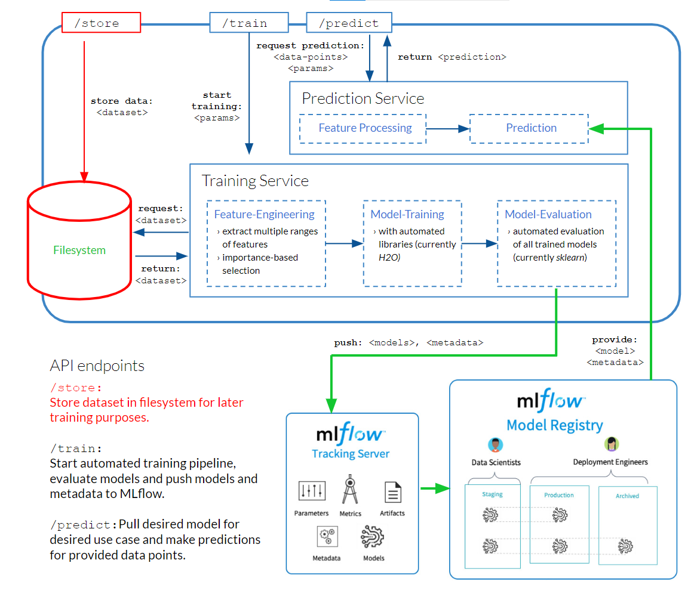
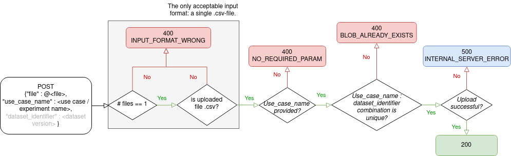
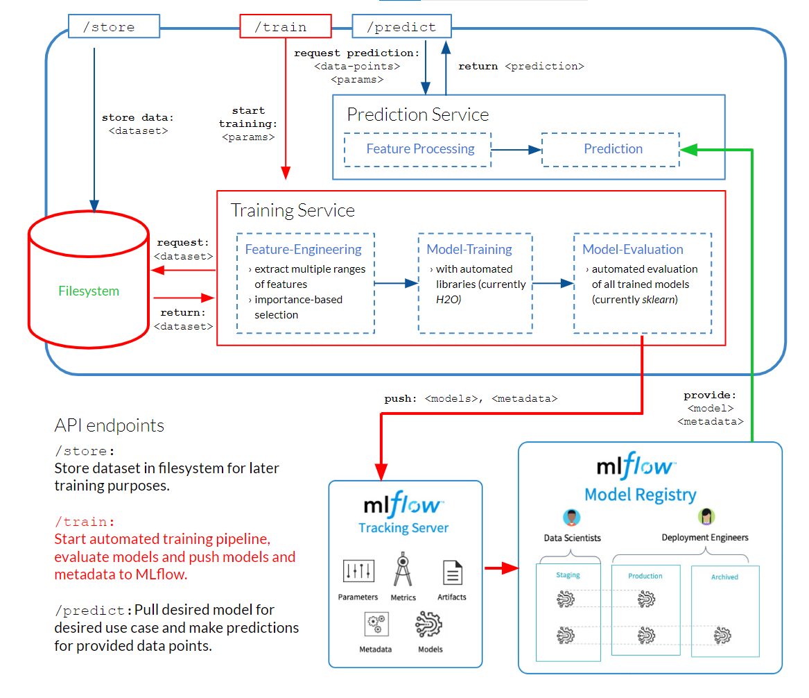
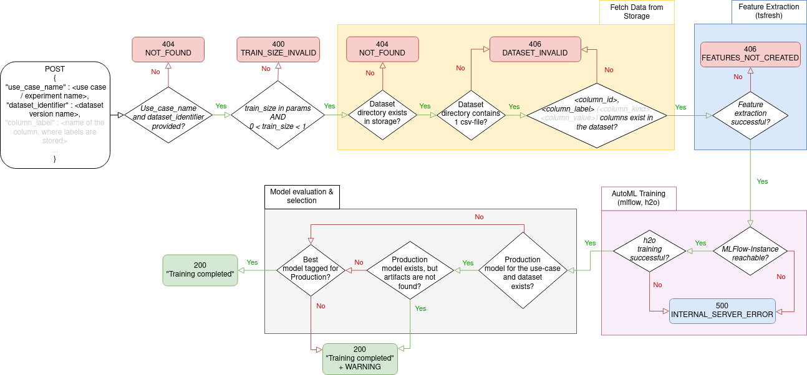
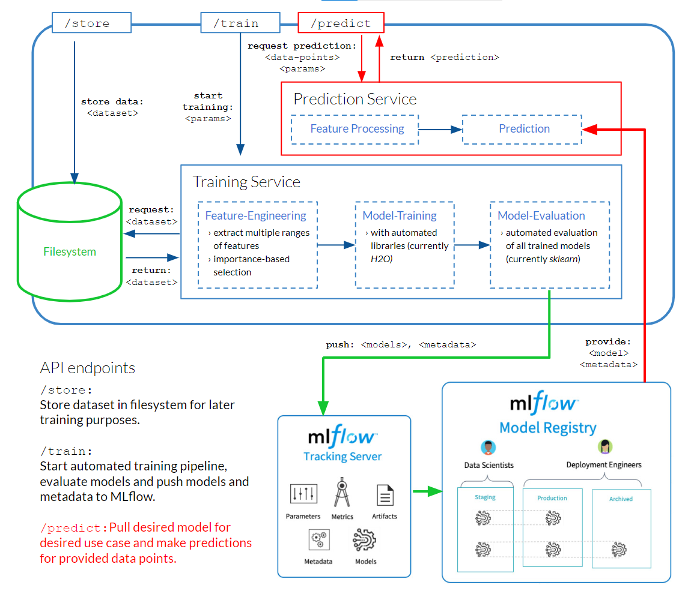
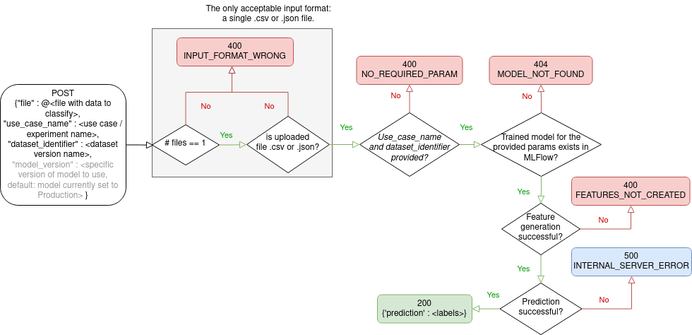

# AutoTiM
> Train and store machine learning models for the classification of timeseries.

## About AutoTiM

This Python application was developed as part of the [Service-Meister project](https://www.servicemeister.org/). The goal of AutoTiM is to train and store machine learning models for the classification of timeseries. Both training and feature engineering are fully automated. The user simply uploads a previously processed timeseries dataset via the */store* endpoint and can use the */train* endpoint to train a set of different model architectures from which the best performing model will be persisted. Finally, the user can test or use the model with the */predict* endpoint. (For more information on how to use this service, see the [Tutorial](#3-tutorial))


This project is part of the collaboration between [KROHNE Messtechnik GmbH](https://de.krohne.com/de/) and [inovex GmbH](https://www.inovex.de/de/) within the [Service-Meister research project](https://www.servicemeister.org/).

Contact: andre.ebert@inovex.de


## Table of Contents
[1. Setup and local execution](#1-setup)  
[2. Service components and architecture](#2-service-components-and-architecture)  
&ensp; [2.1 Architecture overview](#21-architecture-overview)  
&ensp; [2.2 Endpoints](#22-endpoints)  
&ensp; &ensp; &ensp; [2.2.1 Store](#221-store) <br>
&ensp; &ensp; &ensp; [2.2.2 Train](#222-train) <br>
&ensp; &ensp; &ensp; [2.2.3 Predict](#223-predict)  
[3. Tutorial](#3-tutorial)  
[4. Troubleshooting](#4-troubleshooting)  
[5. Project Organization](#5-project-organization)


## 1. Setup and local execution

For starting the local execution of the service, there is a `autotim/autotim/docker-compose.yml` which contains all the necessary services. 
<br>


### Change Environment Variales (Optional)

Configs can be changed in the `./autotim/autotim/.env` directory. Each service has a separate .env file. New environment variables can be easily added or existing ones modified. Mandatory variables are marked accordingly. 


> In some Docker alternatives (e.g. lima nerdctl), the inclusion of .env files does not work. In this case, the variables must be added directly in the docker-compose file under the respective server in the environment tab. 

<br>

If you want to use Google Cloud Platform in local execution for storage, you must store a `gcp-service.json` key. The template for this can be found at `autotim/autotim/.env/gcp-service.json.template`.


### Setup local execution


1. Install [**Docker-compose**](https://docs.docker.com/compose/) (or an equivalent). 
    > _The commercial usage of Docker is licensed._ (Find a suitable alternative for your OS, if using it commercially)

2. Change directory into `./autotim/autotim`. 

3. Build all necessary containers:
    ```shell
    docker-compose build
    ```

### Start local execution

4. Start all services and volumes:
    ```shell
    docker-compose up 
    ```
   This will start 3 separate docker containers:
   - AutoTiM service to `/store` datasets, `/train` models and generate `/predict`-ions for your new data;
   - MlFlow service to log models;
   - PostgreSQL database for the model metadata.

   You can access the services under the following links.

   | Service | Address               | Note                               |
   |---------|-----------------------|------------------------------------| 
   | AutoTiM  | http://localhost:5004 | username=admin , password=password |
   | MlFlow  | http://0.0.0.0:5000   | localhost only works on Windows    |


### Reset local execution
Each of the docker containers have a labeled docker volume to persist data between sessions. 
To delete data and reinitialize your environment (execute these commands from the `./autotim/autotim/` directory):
- stop all running containers
- delete persisted volumes:
  ```bash
  docker-compose down --volumes
  ```

<br> 

### (Extra feature) Start local execution with Google Cloud Storage (GCS)

The autotim service is compatible with the GCS (especially the Google buckets) if a suitable infrastructure is available. You can change the env-variable *"STORAGE"* in [autotim.env](/autotim/autotim_execution/.env/autotim.env) from "local" to "GCS" and fill in the other *gcp-variables* in the specified file accordingly. If so, the [gcp-service.json.template](/autotim/autotim_execution/.env/gcp-service.json.template) must also be set in order to be authorized to connect to the GCP and thus the Google Bucket.  It is crucial that that *gcp-service.json* has a **Google Service Account**, which has the rights to list buckets, create new buckets, read from and write to them. In this case the execution is local, only the storage of models and datasets is moved to the Google Cloud Platform (GCP).

## 2. Service components and architecture
### 2.1 Architecture overview



Our AutoTiM service provides the endpoints `/store`, `/train` and `/predict`. Datasets are stored in the local file system, trained models and associated metadata are logged via [MLFlow](https://mlflow.org/), a 3rd-party tool.

### 2.2 Endpoints
For each of the three endpoints of the AutoTiM-Service this section provides:
* an architecture diagram, showcasing which components of the overall service are influenced by requests sent to the endpoint;
* explanations for the parameters and a request example (with curl);
* eventflow within the endpoint implementation and explanation for the HTTP-Responses the endpoint throws. 

#### 2.2.1 Store



The `/store`-endpoint is used to upload datasets that can later be used for training. This requires specifying the name of the use case for which the dataset is intended and a name for the identifier of the dataset.

##### Required parameters
`use_case_name` (str): Name of the experiment / project <br>
`dataset_identifier` (str): Name of the dataset within your project <br>
`file`: csv-file containing the dataset to be stored

##### Example use with curl
```console
curl -i -X POST --user <username>:<password> -F "file=@<local path to the data file>" -F "use_case_name=<use case / experiment name>"
-F "dataset_identifier=<dataset name>" <URL to the /store endpoint>
```

##### Event Flow & HTTP-Responses



#### 2.2.2 Train



The `/train`-endpoint is used to train a model. For this, the use case as well as the data identifier must be specified. Optionally, the parameters below can be set.
The `/train`-endpoint uses a dataset previously uploaded via `/store`, performs automatic feature-engineering, and conducts an automatic training and tuning of many models. The best model from this training is versioned in MLFLow and compared to models previously trained on the same dataset. The best of these models is marked with the production flag. The model with the production flag is by default used for predictions for the respective use case and dataset combination, if no other version is explicitly requested.

##### Required parameters
`use_case_name` (str): Name of the experiment / project <br>
`dataset_identifier` (str): Name of the dataset within your project

##### Optional parameters
`column_id`: Name of the id column, which assigns each row to a timeseries (default column name: id)<br>
`column_label`: Name of the column containing the classification labels (default: label)<br>
`column_sort`: Name of the column that contains values which allow to sort the time series, e.g. time stamps (default: time)<br>
`column_value`: Name of the column that contains the actual values of the time series, e.g. sensor data (default: None)<br>
`column_kind`: Name of the column that indicates the names of the different timeseries types, e.g. different sensors (default: None)<br>
`train_size`: Proportion of the dataset to include in the train data when performing the train-test-split (default: 0.6)<br>
`recall_average`: Metric to be used to calculate the recall and precision score (default: micro; possible metrics are: micro, macro, samples, weighted, binary or None)<br>
`metric`: Metric to be used for the model selection (default: accuracy; possible metrics are: accuracy, balanced_accuracy, recall_score, precision_score) <br>
`max_features`: Maximum number of features used for training (default: 1000)<br>
`features_decrement`: Decrement step of features when a recursion error occurs. <br> If smaller then `1` this will be percentage based otherwise it will be an absolute value (default: 0.9) <br>
`max_attempts`: Maximum number of attempts for training when failing due to a recursion error. (default: 5)<br>
`train_time`: Time in minutes used for training the model. If not specified it uses the dynamic training time. (default: dynamic)<br>
`evaluation_identifier`: Name of the dataset within your project, only used for evaluation. If specified, `dataset_identifier` only used for training.


##### Example use
```console
https://<URL to the AutoTiM-Service>/train?use_case_name=<use case>&dataset_identifier=<dataset name>
```

##### Event Flow & HTTP-Responses



#### 2.2.3 Predict



The `/predict`-endpoint returns predictions from one or more given data points for the selected use case. By default, the model with the production flag is used, but the model version can be specified if required.

##### Required parameters
`use_case_name` (str): Name of the experiment / project <br>
`dataset_identifier` (str): Name of the dataset within your project <br>
`file`: csv-file containing one or more timeseries instances

##### Optional parameters
`model_version` (int): Version of the model (as listed in MLFLow) to be used for prediction (default: production model)

##### Example use with curl
```console
curl -i -X POST --user <username>:<password> -F "file=@<local path to the data file>" -F "use_case_name=<use case / experiment name>" -F "dataset_identifier=<dataset version>" <URL to the /predict endpoint>
```

##### Event Flow & HTTP-Responses



## 3. Tutorial

Our tutorial shows you how to use all endpoints to train your first model with this service, using a sample dataset. You
can find it [here](doc/tutorial/README.md).

## 4. Troubleshooting

To run the unittests, run `coverage run -m unittest`

## 5. Project Organization

```
├── AUTHORS.md                 <- List of developers and maintainers.
├── CHANGELOG.md               <- Changelog to keep track of new features and fixes.
├── LICENSE.txt                <- License as chosen on the command-line.
├── README.md                  <- The top-level README for developers.
├── doc                        <- Directory for README files.
├── autotim/autotim-execution  <- Directory for local execution.          
├── autotim                    <- Actual Python code where the main functionality goes.
├── tests_autotim              <- Unit tests.
├── .pylintrc                  <- Configuration for pylint tests.
├── doc/tutorial               <- Tutorial for using the service.
├── Dockerfile                 <- Dockerfile for AutoTiM service.
└── requirements.txt           <- Configuration of used python packages.
```
## Note

This project uses the package [tsfresh] for feature engineering and [h2o] to generate the models. For the local execution, [postgres11] and [mlflow] container are used. 


[h2o]: https://docs.h2o.ai/h2o/latest-stable/h2o-py/docs/intro.html
[postgres11]: https://www.postgresql.org/
[mlflow]: https://mlflow.org/
[tsfresh]: https://tsfresh.readthedocs.io/en/latest/
